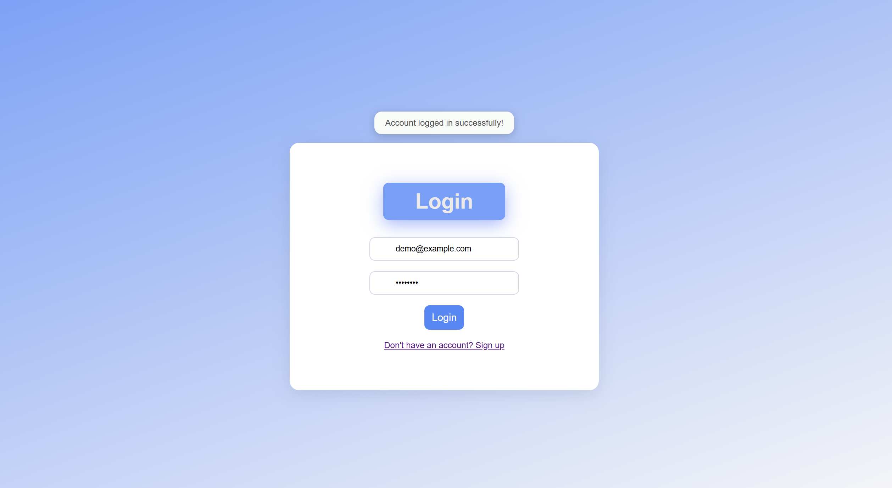
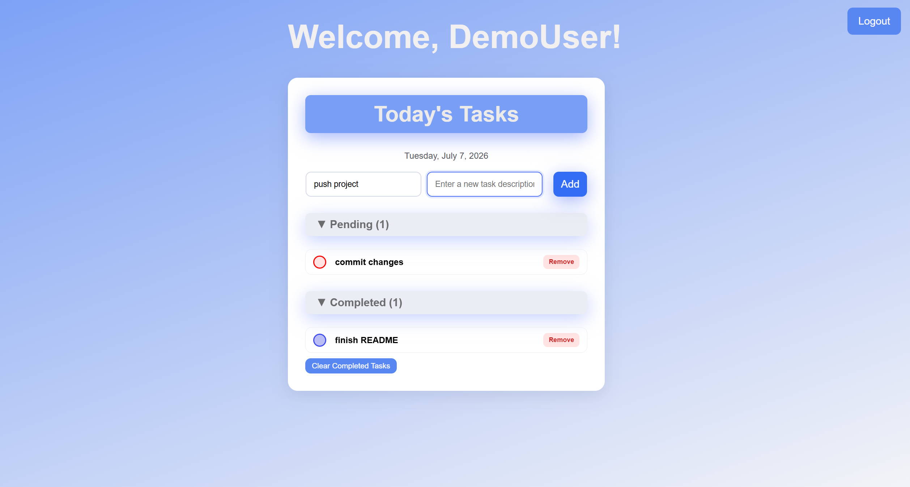

# react-todo-list

A multi user to-do list web application built with React. Users can sign up, log in and manage their own personal task list. Tasks can be added with a title and an optional description, marked as completed, removed individually or cleared in bulk once completed. All data is persisted in the browser via 'localStorage' (no backend required).

## Solution Overview

The app is structured around three page components **SignUp**, **Login** and **ToDoList**, connected with React Router. Authentication is simulated entirely on the client: registered users are kept in a `users` array in `localStorage` and a successful login writes the active user to a `currentUser` key, which acts as the session. The task page checks this key on mount and redirects unauthenticated visitors back to the login page.

Each user's tasks are isolated in a shared `tasksByUser` object, keyed by email. When the task page mounts, a lazy `useState` initializer loads the current user's tasks once. From then on, a `useEffect` watching the task list automatically writes every change back to `localStorage`. All task operations (add, toggle, remove, clear completed) are pure state updates. Persistence is handled in one place by the effect, keeping the logic simple and consistent.

Forms are implemented as controlled components with validation (required fields, email format, password strength) performed with regular expressions beafore any data is saved.

## Features

- **User Authentication (client side)** - sign up, log in, log out with sessions stored in `localStorage`.
- **Form Validation** - required fields, email format check and password rules (min 8 characters, must contain both letters and numbers, no whitespaces).
- **Per-User Task Lists** - each user's tasks are stored seperately, keyed by their email.
- **Task Managment** - add tasks with a title and optional description, mark them as completed, remove them individually, or clear all completed tasks at once.
- **Persistent Data** - tasks and accounts survive page refreshes and browser restarts.
- **Route Protection** - the task page redirects to the login page when no user is logged in.
- **Sorted Task View** - tasks are grouped into **Pending** and **Completed** sections, sorted by creation date (newest first).
- **Collapsible Sections** — the Pending and Completed lists can be collapsed and expanded independently

## Screenshots

### Sign Up


### Login



### Task List



## Tech Stack

- [React](https://react.dev/) (function components + hooks: `useState`, `useEffect`).
- [React Router](https://reactrouter.com/) for client-side routing and navigation.
- [Vite](https://vitejs.dev/) as the build tool and dev server.
- JavaScript (ES6+).
- Plain CSS (per-component stylesheets).
- Web Storage API (`localStorage`) for persistence.

## Getting Started

### Prerequisites

- [Node.js](https://nodejs.org/) (v18 or later recommended).
- npm (comes with Node.js).

### Installation

```bash
# Clone the repository
git clone https://github/Thetis-Maria/<react-todo-list>.git
cd <react-todo-list>

# Install dependencies
npm install

# Start the development
npm run dev
```

Then open the URL shown in the terminal (by default `http://localhost:5173`).

## Usage

1.  **Sign Up** with a username, email, password.
2.  **Login** with your credentials.
3.  **Add Tasks** by entering a title (required) and an optional description.
4.  Click a task's checkbox to **toggle** it between Pending and Completed.
5.  Use **Remove** to delete a single task, or **Clear Completed Tasks** to delete all completed ones.
6.  **Logout** to end your session. Your tasks will still be there next time you log in

## How Data is Stored

All data lives in the browser's `localStorage` under three keys:

| Key           | Contents                                              |
| ------------- | ----------------------------------------------------- |
| `users`       | Array of registered users (username, email, password) |
| `currentUser` | The currently logged-in user (the session)            |
| `tasksByUser` | Object mapping each user's email to their task list   |

Tasks are loaded once when the task page mounts (via lazy `useState` initializer) and saved automatically on every change (via a `useEffect` that watches the task list).

> **Note:** `locationStorage` is scoped to the browser origin (protocol + host + port). If the dev server starts on a different port (e.g. `5174` instead of `5173`), it will appear as a fresh, empty app - the data is still there under the original port.

## Project Structure

```
├── public/
├── screenshots/            # UI screenshots used in this README
├── src/
│   ├── assets/
│   ├── Components/
│   │   ├── Auth.css        # Styles for the auth pages
│   │   ├── Login.jsx       # Login form and session creation
│   │   ├── SignUp.jsx      # Registration form with validation
│   │   ├── ToDoList.css    # Styles for the task page
│   │   └── ToDoList.jsx    # Main task page (protected route)
│   ├── App.jsx             # Root component with the routes
│   ├── index.css           # Global styles
│   └── main.jsx            # App entry point
├── index.html
├── package.json
└── vite.config.js
```
